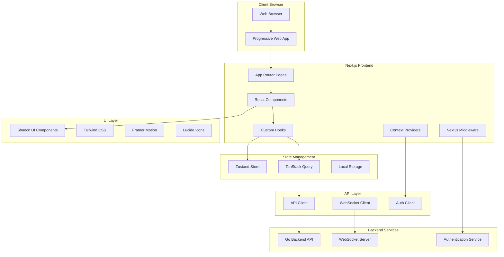
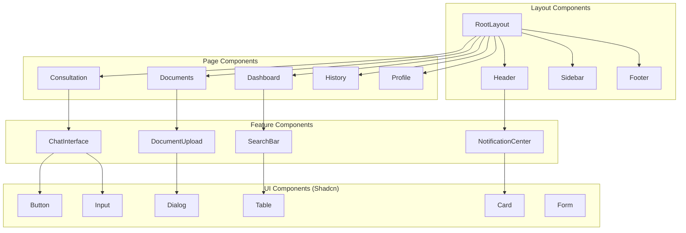

# Design Document

## Overview

The AI Government Consultant frontend is a modern, responsive web application built with Next.js 14 (App Router), TypeScript, and Shadcn UI components. The application provides an intuitive interface for government officials to interact with the AI consultation system, featuring real-time chat interfaces, document management, and comprehensive dashboards.

The frontend follows a component-based architecture with server-side rendering for optimal performance and SEO. It integrates seamlessly with the existing Go backend API through RESTful endpoints and WebSocket connections for real-time features. The design emphasizes accessibility, security, and responsive design to ensure usability across all devices and user capabilities.

## Architecture

### High-Level Architecture



### Component Architecture



## Components and Interfaces

### Core Layout Components

**RootLayout Component**
- Provides global layout structure with header, sidebar, and main content area
- Manages authentication state and route protection
- Implements responsive design breakpoints
- Handles global error boundaries and loading states

```typescript
interface RootLayoutProps {
  children: React.ReactNode;
}

interface LayoutState {
  sidebarOpen: boolean;
  user: User | null;
  notifications: Notification[];
  theme: 'light' | 'dark' | 'system';
}
```

**Header Component**
- Contains navigation, user profile, and notification center
- Implements search functionality across all content
- Provides quick access to new consultation and document upload
- Manages user session and logout functionality

```typescript
interface HeaderProps {
  user: User;
  onSearch: (query: string) => void;
  onNewConsultation: () => void;
  onLogout: () => void;
}
```

**Sidebar Component**
- Navigation menu with role-based visibility
- Recent consultations and quick access links
- Collapsible design for mobile responsiveness
- Integration with routing and active state management

```typescript
interface SidebarProps {
  isOpen: boolean;
  onToggle: () => void;
  currentPath: string;
  userRole: UserRole;
}
```

### Page Components

**Dashboard Component**
- Overview of recent activity, pending consultations, and system status
- Quick action cards for common tasks
- Personalized recommendations and insights
- Real-time updates for consultation status

```typescript
interface DashboardProps {
  user: User;
  recentConsultations: ConsultationSummary[];
  pendingDocuments: DocumentSummary[];
  systemStatus: SystemStatus;
}

interface DashboardState {
  loading: boolean;
  error: string | null;
  refreshInterval: number;
}
```

**Consultation Component**
- Main consultation interface with chat-like interaction similar to ChatGPT
- Primary chatbox interface for text-based conversations
- Side panel with voice interaction controls for natural speech with AI agent
- Real-time speech-to-text transcription with visual feedback
- Text-to-speech playback of AI responses with natural voice synthesis
- Seamless switching between text and voice modes within the same conversation
- Voice activity detection and automatic speech recognition
- Response formatting with expandable sections and source citations

```typescript
interface ConsultationProps {
  sessionId?: string;
  initialType?: ConsultationType;
}

interface ConsultationState {
  messages: Message[];
  isTyping: boolean;
  currentType: ConsultationType;
  context: ConsultationContext;
  attachedDocuments: Document[];
  voiceMode: boolean;
  isRecording: boolean;
  isPlaying: boolean;
  audioLevel: number;
  transcriptionActive: boolean;
}

interface Message {
  id: string;
  type: 'user' | 'assistant';
  content: string;
  timestamp: Date;
  sources?: DocumentReference[];
  confidence?: number;
  metadata?: MessageMetadata;
  audioUrl?: string; // For TTS playback
  transcriptionConfidence?: number; // For STT accuracy
  inputMethod: 'text' | 'voice';
}
```

**Documents Component**
- Document library with grid and list views
- Advanced filtering and search capabilities
- Bulk operations and metadata editing
- Document preview and processing status

```typescript
interface DocumentsProps {
  initialFilters?: DocumentFilters;
}

interface DocumentsState {
  documents: Document[];
  selectedDocuments: string[];
  viewMode: 'grid' | 'list';
  filters: DocumentFilters;
  sortBy: DocumentSortOption;
  loading: boolean;
}

interface DocumentFilters {
  category?: DocumentCategory;
  dateRange?: DateRange;
  classification?: SecurityClassification;
  tags?: string[];
  searchQuery?: string;
}
```

### Feature Components

**ChatInterface Component**
- Real-time messaging with WebSocket connection
- Primary text input area with rich text support and auto-resize
- Side-mounted voice control panel with microphone activation
- Continuous speech recognition with real-time transcription display
- Voice activity detection with visual audio level indicators
- Push-to-talk and continuous listening modes
- Automatic text-to-speech playback of AI responses
- Voice settings panel for speech rate, voice selection, and audio preferences
- File attachment and document reference capabilities
- Message history and context management with voice/text indicators

```typescript
interface ChatInterfaceProps {
  sessionId: string;
  onMessageSent: (message: string, attachments?: File[], inputMethod: 'text' | 'voice') => void;
  onVoiceInput: (audioBlob: Blob) => void;
  onVoiceSettingsChange: (settings: VoiceSettings) => void;
}

interface ChatInterfaceState {
  messages: Message[];
  inputValue: string;
  isRecording: boolean;
  attachments: File[];
  isConnected: boolean;
  voicePanelOpen: boolean;
  audioLevel: number;
  transcriptionText: string;
  isTranscribing: boolean;
  voiceSettings: VoiceSettings;
  listeningMode: 'push-to-talk' | 'continuous';
}

interface VoiceSettings {
  voice: string;
  speechRate: number;
  volume: number;
  autoPlayResponses: boolean;
  showTranscription: boolean;
  language: string;
}
```

**DocumentUpload Component**
- Drag-and-drop file upload with progress tracking
- File validation and format checking
- Metadata input and classification selection
- Batch upload support with queue management

```typescript
interface DocumentUploadProps {
  onUploadComplete: (documents: Document[]) => void;
  onUploadError: (error: UploadError) => void;
  maxFiles?: number;
  acceptedTypes?: string[];
}

interface UploadState {
  files: UploadFile[];
  uploadProgress: Record<string, number>;
  errors: Record<string, string>;
  isUploading: boolean;
}

interface UploadFile {
  file: File;
  id: string;
  metadata: DocumentMetadata;
  status: 'pending' | 'uploading' | 'processing' | 'complete' | 'error';
}
```

**SearchBar Component**
- Global search across documents, consultations, and knowledge base
- Auto-complete suggestions and search history
- Advanced search filters and operators
- Search result highlighting and navigation

```typescript
interface SearchBarProps {
  onSearch: (query: string, filters?: SearchFilters) => void;
  placeholder?: string;
  showFilters?: boolean;
}

interface SearchState {
  query: string;
  suggestions: SearchSuggestion[];
  history: string[];
  filters: SearchFilters;
  isOpen: boolean;
}
```

### API Integration Layer

**API Client**
- Centralized HTTP client with authentication handling
- Request/response interceptors for error handling
- Retry logic and timeout management
- Type-safe API calls with generated types

```typescript
interface APIClient {
  auth: AuthAPI;
  documents: DocumentsAPI;
  consultations: ConsultationsAPI;
  knowledge: KnowledgeAPI;
  audit: AuditAPI;
}

interface AuthAPI {
  login(credentials: LoginCredentials): Promise<AuthResponse>;
  logout(): Promise<void>;
  refreshToken(): Promise<AuthResponse>;
  getCurrentUser(): Promise<User>;
}

interface DocumentsAPI {
  upload(files: File[], metadata: DocumentMetadata[]): Promise<Document[]>;
  getDocuments(filters?: DocumentFilters): Promise<DocumentsResponse>;
  getDocument(id: string): Promise<Document>;
  updateDocument(id: string, updates: Partial<Document>): Promise<Document>;
  deleteDocument(id: string): Promise<void>;
  searchDocuments(query: string): Promise<SearchResult[]>;
}

interface ConsultationsAPI {
  createSession(type: ConsultationType): Promise<ConsultationSession>;
  sendMessage(sessionId: string, message: string, inputMethod?: 'text' | 'voice'): Promise<ConsultationResponse>;
  sendVoiceMessage(sessionId: string, audioBlob: Blob): Promise<ConsultationResponse>;
  getSession(sessionId: string): Promise<ConsultationSession>;
  getSessions(filters?: SessionFilters): Promise<ConsultationSession[]>;
  exportSession(sessionId: string, format: ExportFormat): Promise<Blob>;
  transcribeAudio(audioBlob: Blob, options?: TranscriptionOptions): Promise<TranscriptionResult>;
  synthesizeSpeech(text: string, options?: TTSOptions): Promise<AudioResult>;
  getAvailableVoices(): Promise<Voice[]>;
}
```

**WebSocket Client**
- Real-time communication for chat interfaces
- Connection management with automatic reconnection
- Message queuing for offline scenarios
- Event-driven architecture for real-time updates

```typescript
interface WebSocketClient {
  connect(sessionId: string): Promise<void>;
  disconnect(): void;
  sendMessage(message: WebSocketMessage): void;
  onMessage(callback: (message: WebSocketMessage) => void): void;
  onConnectionChange(callback: (connected: boolean) => void): void;
}

interface WebSocketMessage {
  type: 'message' | 'typing' | 'status' | 'error';
  sessionId: string;
  data: any;
  timestamp: Date;
}
```

## Data Models

### Frontend-Specific Models

```typescript
// UI State Models
interface UIState {
  theme: 'light' | 'dark' | 'system';
  sidebarCollapsed: boolean;
  notifications: Notification[];
  loading: Record<string, boolean>;
  errors: Record<string, string>;
}

interface Notification {
  id: string;
  type: 'info' | 'success' | 'warning' | 'error';
  title: string;
  message: string;
  timestamp: Date;
  read: boolean;
  actions?: NotificationAction[];
}

interface NotificationAction {
  label: string;
  action: () => void;
  variant?: 'default' | 'destructive';
}

// Form Models
interface LoginForm {
  email: string;
  password: string;
  mfaCode?: string;
  rememberMe: boolean;
}

interface DocumentUploadForm {
  files: File[];
  metadata: DocumentMetadata;
  classification: SecurityClassification;
  tags: string[];
  department: string;
}

interface ConsultationForm {
  type: ConsultationType;
  query: string;
  context?: string;
  attachedDocuments?: string[];
  priority: Priority;
}

// View Models (transformed from backend models)
interface DocumentViewModel {
  id: string;
  name: string;
  type: string;
  size: string; // formatted size
  uploadedAt: string; // formatted date
  status: ProcessingStatus;
  classification: SecurityClassification;
  thumbnail?: string;
  downloadUrl?: string;
  previewUrl?: string;
}

interface ConsultationViewModel {
  id: string;
  title: string;
  type: ConsultationType;
  status: SessionStatus;
  createdAt: string; // formatted date
  lastActivity: string; // formatted date
  messageCount: number;
  hasUnread: boolean;
  summary?: string;
}

interface MessageViewModel {
  id: string;
  type: 'user' | 'assistant';
  content: string;
  timestamp: string; // formatted time
  sources?: SourceViewModel[];
  confidence?: number;
  isStreaming?: boolean;
  reactions?: MessageReaction[];
  inputMethod: 'text' | 'voice';
  audioUrl?: string; // For TTS playback
  transcriptionConfidence?: number; // For voice messages
  canPlayAudio?: boolean;
  isPlaying?: boolean;
}

interface SourceViewModel {
  id: string;
  title: string;
  type: 'document' | 'knowledge' | 'research';
  excerpt: string;
  confidence: number;
  url?: string;
}
```

### State Management Models

```typescript
// Zustand Store Interfaces
interface AuthStore {
  user: User | null;
  token: string | null;
  isAuthenticated: boolean;
  login: (credentials: LoginCredentials) => Promise<void>;
  logout: () => void;
  refreshToken: () => Promise<void>;
}

interface UIStore {
  theme: Theme;
  sidebarOpen: boolean;
  notifications: Notification[];
  setTheme: (theme: Theme) => void;
  toggleSidebar: () => void;
  addNotification: (notification: Omit<Notification, 'id' | 'timestamp'>) => void;
  removeNotification: (id: string) => void;
  markNotificationRead: (id: string) => void;
}

interface ConsultationStore {
  currentSession: ConsultationSession | null;
  sessions: ConsultationSession[];
  createSession: (type: ConsultationType) => Promise<ConsultationSession>;
  sendMessage: (message: string) => Promise<void>;
  loadSessions: () => Promise<void>;
  setCurrentSession: (session: ConsultationSession | null) => void;
}

interface DocumentStore {
  documents: Document[];
  selectedDocuments: string[];
  filters: DocumentFilters;
  uploadDocuments: (files: File[], metadata: DocumentMetadata[]) => Promise<void>;
  loadDocuments: (filters?: DocumentFilters) => Promise<void>;
  selectDocument: (id: string) => void;
  deselectDocument: (id: string) => void;
  setFilters: (filters: DocumentFilters) => void;
}
```

## Error Handling

### Error Boundary Strategy

```typescript
interface ErrorBoundaryState {
  hasError: boolean;
  error: Error | null;
  errorInfo: ErrorInfo | null;
}

class GlobalErrorBoundary extends Component<PropsWithChildren, ErrorBoundaryState> {
  // Catches JavaScript errors anywhere in the child component tree
  // Logs error details and displays fallback UI
  // Provides error reporting to monitoring services
}

class FeatureErrorBoundary extends Component<PropsWithChildren, ErrorBoundaryState> {
  // Catches errors within specific features
  // Allows rest of application to continue functioning
  // Provides feature-specific error recovery options
}
```

### API Error Handling

```typescript
interface APIError {
  code: string;
  message: string;
  details?: Record<string, any>;
  timestamp: Date;
  requestId: string;
}

interface ErrorHandler {
  handleAuthError: (error: APIError) => void;
  handleNetworkError: (error: NetworkError) => void;
  handleValidationError: (error: ValidationError) => void;
  handleServerError: (error: ServerError) => void;
}

// Error Recovery Strategies
interface ErrorRecovery {
  retry: (operation: () => Promise<any>, maxAttempts: number) => Promise<any>;
  fallback: (primaryOperation: () => Promise<any>, fallbackOperation: () => Promise<any>) => Promise<any>;
  gracefulDegradation: (feature: string, fallbackComponent: React.ComponentType) => React.ComponentType;
}
```

### Form Validation

```typescript
interface ValidationSchema {
  [field: string]: ValidationRule[];
}

interface ValidationRule {
  type: 'required' | 'email' | 'minLength' | 'maxLength' | 'pattern' | 'custom';
  value?: any;
  message: string;
  validator?: (value: any) => boolean;
}

interface ValidationResult {
  isValid: boolean;
  errors: Record<string, string>;
}
```

## Testing Strategy

### Testing Pyramid

1. **Unit Tests (70%)**:
   - Component testing with React Testing Library
   - Hook testing with custom test utilities
   - Utility function testing
   - Store/state management testing

2. **Integration Tests (20%)**:
   - API integration testing with MSW (Mock Service Worker)
   - Component integration testing
   - User workflow testing
   - WebSocket connection testing

3. **End-to-End Tests (10%)**:
   - Critical user journeys with Playwright
   - Cross-browser compatibility testing
   - Accessibility testing
   - Performance testing

### Testing Tools and Configuration

```typescript
// Jest Configuration
interface JestConfig {
  testEnvironment: 'jsdom';
  setupFilesAfterEnv: ['<rootDir>/src/test/setup.ts'];
  moduleNameMapping: {
    '^@/(.*)$': '<rootDir>/src/$1';
  };
  collectCoverageFrom: [
    'src/**/*.{ts,tsx}',
    '!src/**/*.d.ts',
    '!src/test/**/*',
  ];
}

// Testing Utilities
interface TestUtils {
  renderWithProviders: (component: React.ReactElement, options?: RenderOptions) => RenderResult;
  createMockUser: (overrides?: Partial<User>) => User;
  createMockConsultation: (overrides?: Partial<ConsultationSession>) => ConsultationSession;
  mockAPIResponse: (endpoint: string, response: any) => void;
}

// Accessibility Testing
interface A11yTestConfig {
  rules: {
    'color-contrast': { enabled: true };
    'keyboard-navigation': { enabled: true };
    'screen-reader': { enabled: true };
    'focus-management': { enabled: true };
  };
}
```

### Performance Testing

```typescript
interface PerformanceMetrics {
  firstContentfulPaint: number;
  largestContentfulPaint: number;
  cumulativeLayoutShift: number;
  firstInputDelay: number;
  timeToInteractive: number;
}

interface PerformanceThresholds {
  fcp: 1800; // First Contentful Paint < 1.8s
  lcp: 2500; // Largest Contentful Paint < 2.5s
  cls: 0.1;  // Cumulative Layout Shift < 0.1
  fid: 100;  // First Input Delay < 100ms
  tti: 3800; // Time to Interactive < 3.8s
}
```

The testing strategy ensures the frontend meets government standards for reliability, accessibility, and performance while providing comprehensive coverage of all user interactions and system integrations.

## Security Considerations

### Authentication & Authorization

```typescript
interface SecurityConfig {
  tokenStorage: 'httpOnly' | 'localStorage' | 'sessionStorage';
  tokenRefreshThreshold: number; // minutes before expiry
  maxLoginAttempts: number;
  sessionTimeout: number; // minutes
  requireMFA: boolean;
}

interface CSRFProtection {
  enabled: boolean;
  tokenHeader: string;
  cookieName: string;
}

interface ContentSecurityPolicy {
  defaultSrc: string[];
  scriptSrc: string[];
  styleSrc: string[];
  imgSrc: string[];
  connectSrc: string[];
}
```

### Data Protection

```typescript
interface DataProtection {
  encryptSensitiveData: boolean;
  sanitizeUserInput: boolean;
  validateFileUploads: boolean;
  preventXSS: boolean;
  preventClickjacking: boolean;
}

interface AuditLogging {
  logUserActions: boolean;
  logAPIRequests: boolean;
  logSecurityEvents: boolean;
  retentionPeriod: number; // days
}
```

The design ensures a secure, accessible, and performant frontend that seamlessly integrates with the existing backend while providing an intuitive user experience for government officials.