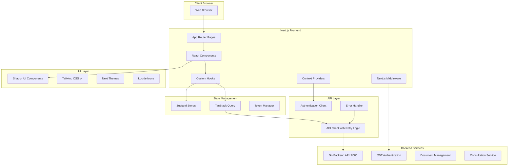
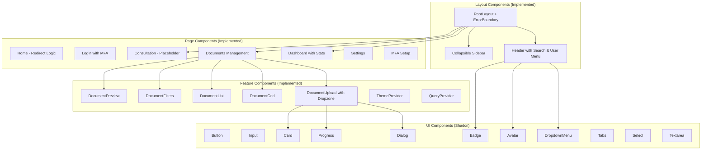

# Frontend Design Document

## Overview

The AI Government Consultant frontend is a modern, responsive web application built with Next.js 15 (App Router), React 19, TypeScript, and Shadcn UI components. The application provides an intuitive interface for government officials to interact with the AI consultation system, featuring document management, user authentication, and a comprehensive dashboard.

The frontend follows a component-based architecture with client-side rendering and integrates with the existing Go backend API through RESTful endpoints. The design emphasizes accessibility, security, and responsive design to ensure usability across all devices and user capabilities.

**Current Implementation Status:**
- ✅ Authentication system with JWT tokens and MFA support
- ✅ Document management with upload, filtering, and search
- ✅ User dashboard with profile management
- ✅ Responsive layout with header, sidebar, and main content areas
- ✅ State management with Zustand stores
- ✅ API client with error handling and retry logic
- ✅ Comprehensive testing setup with Jest and React Testing Library
- 🚧 Consultation interface (placeholder implementation)
- ❌ Real-time chat functionality
- ❌ Voice interaction capabilities
- ❌ WebSocket integration

## Architecture

### High-Level Architecture



### Component Architecture



## Components and Interfaces

### Core Layout Components (Implemented)

**RootLayout Component**
- Provides global layout structure with header, sidebar, and main content area
- Manages authentication state and route protection with automatic redirects
- Implements responsive design breakpoints for mobile/desktop
- Includes LayoutErrorBoundary for error handling
- Handles loading states during authentication checks

```typescript
interface RootLayoutProps {
  children: React.ReactNode;
}

// Implemented with authentication flow:
// - Checks auth status on mount
// - Redirects unauthenticated users to login
// - Redirects authenticated users from login to dashboard
// - Shows loading spinner during auth checks
```

**Header Component (Implemented)**
- Contains responsive navigation with mobile menu toggle
- Implements global search with dropdown results
- Provides quick access buttons for new consultation and document upload
- User dropdown menu with profile, settings, and logout
- Theme toggle (light/dark mode)
- Notification bell with unread count badge
- Responsive design with mobile-optimized layout

```typescript
interface HeaderProps {
  onSearch?: (query: string) => void;
  onNewConsultation?: () => void;
  searchResults?: SearchResult[];
  isSearching?: boolean;
}

// Features implemented:
// - Global search with real-time results
// - User avatar with initials fallback
// - Notification system integration
// - Theme switching
// - Mobile-responsive design
// - Quick action buttons
```

**Sidebar Component (Implemented)**
- Navigation menu with role-based visibility (admin-only routes)
- Active route highlighting with proper ARIA attributes
- Collapsible design with mobile overlay
- User profile display at bottom
- Badge support for item counts
- Keyboard navigation support

```typescript
interface SidebarProps {
  className?: string;
}

// Navigation items implemented:
// - Dashboard, New Consultation, Documents, History
// - Settings (always visible)
// - Admin-only: Analytics, User Management, Audit Trail
// - Role-based filtering with user.role check
// - Mobile-responsive with overlay and close button
```

### Page Components (Implemented)

**Dashboard Component**
- Welcome message with user name
- Statistics cards showing consultation and document metrics
- User profile information card with security settings
- MFA setup integration with conditional display
- Quick action buttons for common tasks
- Recent activity timeline (static data for now)
- Client-side authentication check with redirect

```typescript
// No props - uses auth store directly
export default function DashboardPage()

// Features implemented:
// - Stats grid with icons and colors
// - Profile information display
// - MFA status indicator and setup button
// - Quick action cards for navigation
// - Recent activity list
// - Responsive grid layout
```

**Consultation Component (Placeholder)**
- Currently shows placeholder interface with title and description
- Planned to be the main chat interface for AI consultations
- Will integrate with backend consultation service
- Future implementation will include real-time messaging

```typescript
export default function ConsultationPage()

// Current implementation:
// - Simple card layout with placeholder content
// - References to future Task 7 implementation
// - No interactive functionality yet

// Planned features:
// - Chat interface similar to ChatGPT
// - Real-time messaging with WebSocket
// - Document attachment support
// - Voice interaction capabilities
// - Response formatting with sources
```

**Documents Component (Fully Implemented)**
- Complete document management interface with grid/list view toggle
- Advanced search and filtering with real-time updates
- Bulk operations (select all, bulk delete, bulk download)
- Document upload modal with drag-and-drop support
- Document preview, edit, and delete functionality
- Responsive design with mobile-optimized layout
- Integration with React Query for data fetching and caching

```typescript
export default function DocumentsPage()

// Implemented features:
// - Grid and list view modes with toggle
// - Search bar with real-time filtering
// - Advanced filters sidebar (collapsible)
// - Bulk selection and operations
// - Upload modal with DocumentUpload component
// - Document preview modal
// - Sort functionality
// - Loading and error states
// - Responsive design
// - Integration with document store and API

interface DocumentFilters {
  category?: string;
  classification?: 'public' | 'internal' | 'confidential' | 'secret';
  tags?: string[];
  dateRange?: { start: Date; end: Date };
  searchQuery?: string;
  status?: 'uploading' | 'processing' | 'completed' | 'error';
}
```

### Feature Components (Implemented)

**DocumentUpload Component (Fully Implemented)**
- Drag-and-drop file upload with react-dropzone
- File validation (type, size limits)
- Metadata editing modal for each file
- Progress tracking with visual indicators
- Support for multiple file formats (PDF, DOC, DOCX, XLS, XLSX, PPT, PPTX, TXT, CSV, JSON, XML)
- Classification levels and tagging system
- Error handling and retry functionality

```typescript
interface DocumentUploadProps {
  onUploadComplete?: (documents: any[]) => void;
  onUploadError?: (error: string) => void;
  maxFiles?: number;
  acceptedTypes?: string[];
  className?: string;
}

// Implemented features:
// - Drag-and-drop zone with visual feedback
// - File validation and error messages
// - Metadata editing modal with form fields
// - Progress bars for upload status
// - Tag management system
// - Classification selection
// - File removal before upload
// - Batch upload support
// - Integration with API client
```

**Document Grid/List Components (Implemented)**
- DocumentGrid: Card-based layout with thumbnails and metadata
- DocumentList: Table-based layout with sortable columns
- DocumentFilters: Sidebar with category, classification, date range, and tag filters
- DocumentPreview: Modal for viewing document details and content
- Responsive design with mobile optimization
- Selection support for bulk operations

```typescript
// DocumentGrid - displays documents in card format
interface DocumentGridProps {
  documents: Document[];
  selectedDocuments: string[];
  onSelectDocument: (id: string) => void;
  onDeselectDocument: (id: string) => void;
  onPreviewDocument: (document: Document) => void;
  onEditDocument: (document: Document) => void;
  onDownloadDocument: (document: Document) => void;
  onDeleteDocument: (document: Document) => void;
}

// DocumentList - displays documents in table format
interface DocumentListProps extends DocumentGridProps {
  onSelectAll: (documentIds: string[]) => void;
  onSort: (field: string, direction: 'asc' | 'desc') => void;
  sortField: string;
  sortDirection: 'asc' | 'desc';
}
```

**Authentication Components (Implemented)**
- Login page with email/password and MFA support
- MFA setup page with QR code generation
- Password strength validation
- Remember me functionality
- Account lockout after failed attempts
- Automatic token refresh
- Logout functionality with token cleanup

```typescript
// Login page with comprehensive authentication flow
export default function LoginPage()

// MFA setup page for two-factor authentication
export default function MFASetupPage()

// Features implemented:
// - Form validation with error messages
// - Loading states during authentication
// - MFA code input and verification
// - QR code display for authenticator apps
// - Backup codes generation
// - Integration with auth store and API
// - Responsive design
// - Accessibility support
```

### API Integration Layer (Implemented)

**API Client (Comprehensive Implementation)**
- Centralized APIClient class with modular service organization
- Request/response interceptors for authentication and error handling
- Automatic token refresh with retry logic
- Comprehensive error handling with custom APIError class
- Timeout management and retry configuration
- Type-safe API calls with TypeScript interfaces

```typescript
class APIClient {
  // Organized into service modules
  auth: AuthAPI;
  documents: DocumentsAPI;
  consultations: ConsultationsAPI;
  users: UsersAPI;
  audit: AuditAPI;
}

// Implemented features:
// - Automatic Bearer token injection
// - Token refresh on 401 errors
// - Retry logic with exponential backoff
// - Request/response interceptors
// - Error classification (network, auth, server, client)
// - Timeout handling with AbortController
// - FormData support for file uploads
// - Query parameter handling
// - Response caching integration

interface APIError extends Error {
  status: number;
  code?: string;
  details?: Record<string, unknown>;
  requestId?: string;
  isNetworkError: boolean;
  isAuthError: boolean;
  isServerError: boolean;
  isRetryable: boolean;
}
```

**Token Management (Implemented)**
- Secure token storage and management
- Automatic token validation and refresh
- Token expiration handling
- Secure storage considerations

```typescript
class TokenManager {
  getToken(): string | null;
  getRefreshToken(): string | null;
  setTokens(accessToken: string, refreshToken: string): void;
  clearTokens(): void;
  isTokenValid(): boolean;
  shouldRefreshToken(): boolean;
  getTokenPayload(): TokenPayload | null;
}

// Features implemented:
// - JWT token parsing and validation
// - Expiration checking with buffer time
// - Secure token storage in localStorage
// - Token payload extraction
// - Automatic cleanup on logout
```

## Data Models (Implemented)

### Core Data Models

```typescript
// User Model (matches backend)
interface User {
  id: string;
  email: string;
  name: string;
  role: 'admin' | 'analyst' | 'manager' | 'viewer' | 'consultant';
  department?: string;
  permissions?: Array<{
    resource: string;
    actions: string[];
  }>;
  security_clearance?: string;
  mfa_enabled: boolean;
  last_login?: string;
  created_at: string;
  updated_at: string;
  is_active: boolean;
}

// Document Model (matches backend)
interface Document {
  id: string;
  name: string;
  type: string;
  size: number;
  uploadedAt: Date;
  userId: string;
  status: 'uploading' | 'processing' | 'completed' | 'error';
  classification?: 'public' | 'internal' | 'confidential' | 'secret';
  tags: string[];
  metadata: DocumentMetadata;
  downloadUrl?: string;
  previewUrl?: string;
  thumbnail?: string;
}

// Authentication Models
interface LoginCredentials {
  email: string;
  password: string;
  mfaCode?: string;
  rememberMe?: boolean;
}

interface AuthResponse {
  user: User;
  tokens: {
    access_token: string;
    refresh_token: string;
    expires_at: string;
  };
  message?: string;
  session_id?: string;
}
```

### State Management Models (Implemented)

```typescript
// Auth Store (Fully Implemented)
interface AuthStore {
  user: User | null;
  isAuthenticated: boolean;
  isLoading: boolean;
  error: string | null;
  loginAttempts: number;
  isLocked: boolean;
  login: (credentials: LoginCredentials) => Promise<void>;
  logout: () => Promise<void>;
  refreshToken: () => Promise<void>;
  getCurrentUser: () => Promise<void>;
  checkAuth: () => Promise<void>;
  clearError: () => void;
  resetLoginAttempts: () => void;
}

// UI Store (Implemented)
interface UIStore {
  sidebarOpen: boolean;
  notifications: Notification[];
  toggleSidebar: () => void;
  setSidebarOpen: (open: boolean) => void;
  addNotification: (notification: Omit<Notification, 'id' | 'timestamp'>) => void;
  removeNotification: (id: string) => void;
  markNotificationRead: (id: string) => void;
}

// Document Store (Fully Implemented)
interface DocumentStore {
  selectedDocuments: string[];
  viewMode: 'grid' | 'list';
  filters: DocumentFilters;
  sortBy: DocumentSortOption;
  uploadProgress: Record<string, DocumentUploadProgress>;
  isUploading: boolean;
  showUploadModal: boolean;
  // Selection actions
  selectDocument: (id: string) => void;
  deselectDocument: (id: string) => void;
  selectAllDocuments: (documentIds: string[]) => void;
  clearSelection: () => void;
  // View actions
  setViewMode: (mode: 'grid' | 'list') => void;
  setFilters: (filters: Partial<DocumentFilters>) => void;
  setSortBy: (sortBy: DocumentSortOption) => void;
  // Upload actions
  startUpload: (files: File[]) => void;
  updateUploadProgress: (fileId: string, progress: Partial<DocumentUploadProgress>) => void;
  completeUpload: (fileId: string, document?: Document) => void;
  failUpload: (fileId: string, error: string) => void;
}
```

## Error Handling (Implemented)

### Error Boundary Strategy

```typescript
// LayoutErrorBoundary (Implemented)
export class LayoutErrorBoundary extends React.Component<
  { children: React.ReactNode },
  ErrorBoundaryState
> {
  // Features implemented:
  // - Catches JavaScript errors in layout components
  // - Displays user-friendly error message
  // - Provides reload button for recovery
  // - Logs errors to console (ready for monitoring integration)
  // - Prevents entire app crash
}

interface ErrorBoundaryState {
  hasError: boolean;
  error: Error | null;
}

// Error display includes:
// - "Something went wrong" message
// - Reload page button
// - Styled error UI matching app theme
```

### API Error Handling (Implemented)

```typescript
// APIError Class (Comprehensive Implementation)
export class APIError extends Error {
  constructor(
    message: string,
    public status: number,
    public code?: string,
    public details?: Record<string, unknown>,
    public requestId?: string
  ) {
    super(message);
    this.name = 'APIError';
  }

  // Error classification methods
  get isNetworkError(): boolean { return this.status === 0; }
  get isAuthError(): boolean { return this.status === 401 || this.status === 403; }
  get isServerError(): boolean { return this.status >= 500; }
  get isClientError(): boolean { return this.status >= 400 && this.status < 500; }
  get isRetryable(): boolean { return this.isNetworkError || this.isServerError || this.status === 429; }
}

// Error Recovery (Implemented)
// - Automatic retry with exponential backoff
// - Token refresh on 401 errors
// - Request timeout handling with AbortController
// - Network error detection and handling
// - User-friendly error messages in UI components
// - Loading states during error recovery
```

### Form Validation (Implemented)

```typescript
// Form validation implemented using:
// - React Hook Form for form state management
// - Zod for schema validation
// - Custom validation rules for business logic

// Example implementations:
// - Login form with email/password validation
// - MFA code validation (6-digit numeric)
// - Document upload form with file validation
// - Metadata forms with required field validation

// Features implemented:
// - Real-time validation feedback
// - Error message display
// - Form submission prevention on validation errors
// - Accessibility support with ARIA attributes
// - Custom validation rules for government-specific requirements
```

## Testing Strategy (Implemented)

### Testing Setup and Configuration

```typescript
// Jest Configuration (Implemented)
// - jsdom test environment for React components
// - Module path mapping for @/ imports
// - Coverage collection from src directory
// - Setup files for test utilities

// Testing Tools Implemented:
// - Jest 30.0.5 for test runner
// - React Testing Library 16.3.0 for component testing
// - @testing-library/user-event for user interaction simulation
// - @testing-library/jest-dom for custom matchers

// Test Scripts Available:
// - npm run test: Run all tests
// - npm run test:watch: Watch mode for development
// - npm run test:coverage: Generate coverage reports
// - npm run test:integration: Run integration tests
// - npm run test:auth: Authentication-specific tests
// - npm run test:documents: Document management tests
```

### Performance Testing

```typescript
interface PerformanceMetrics {
  firstContentfulPaint: number;
  largestContentfulPaint: number;
  cumulativeLayoutShift: number;
  firstInputDelay: number;
  timeToInteractive: number;
}

interface PerformanceThresholds {
  fcp: 1800; // First Contentful Paint < 1.8s
  lcp: 2500; // Largest Contentful Paint < 2.5s
  cls: 0.1;  // Cumulative Layout Shift < 0.1
  fid: 100;  // First Input Delay < 100ms
  tti: 3800; // Time to Interactive < 3.8s
}
```

The testing strategy ensures the frontend meets government standards for reliability, accessibility, and performance while providing comprehensive coverage of all user interactions and system integrations.

## Security Considerations

### Authentication & Authorization

```typescript
interface SecurityConfig {
  tokenStorage: 'httpOnly' | 'localStorage' | 'sessionStorage';
  tokenRefreshThreshold: number; // minutes before expiry
  maxLoginAttempts: number;
  sessionTimeout: number; // minutes
  requireMFA: boolean;
}

interface CSRFProtection {
  enabled: boolean;
  tokenHeader: string;
  cookieName: string;
}

interface ContentSecurityPolicy {
  defaultSrc: string[];
  scriptSrc: string[];
  styleSrc: string[];
  imgSrc: string[];
  connectSrc: string[];
}
```

### Data Protection

```typescript
interface DataProtection {
  encryptSensitiveData: boolean;
  sanitizeUserInput: boolean;
  validateFileUploads: boolean;
  preventXSS: boolean;
  preventClickjacking: boolean;
}

interface AuditLogging {
  logUserActions: boolean;
  logAPIRequests: boolean;
  logSecurityEvents: boolean;
  retentionPeriod: number; // days
}
```

The design ensures a secure, accessible, and performant frontend that seamlessly integrates with the existing backend while providing an intuitive user experience for government officials.