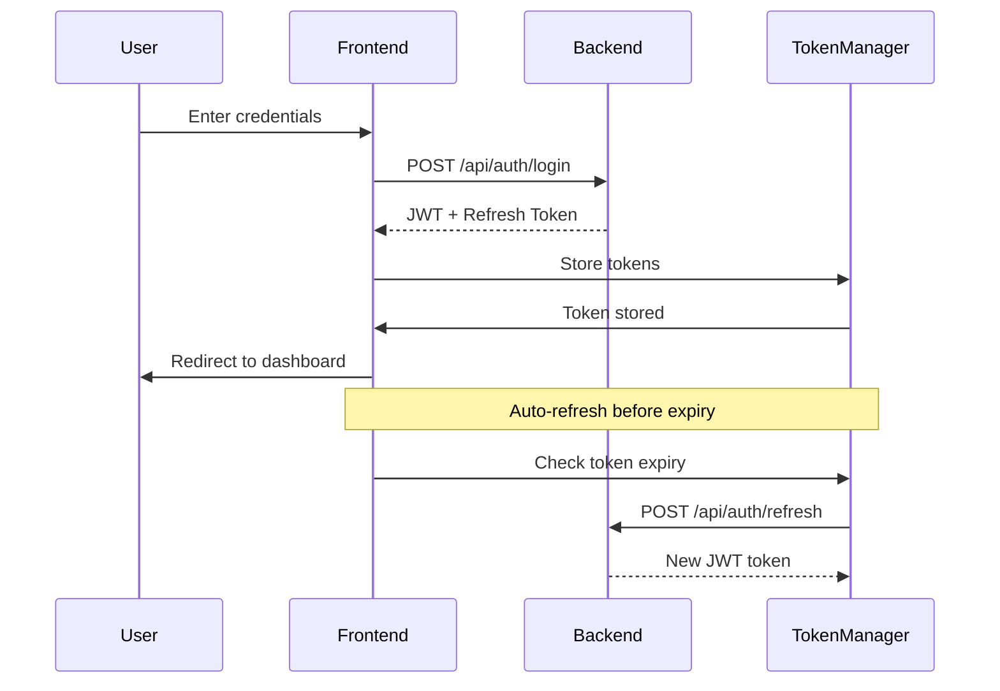

# Authentication System

This document describes the authentication system implemented for the AI Government Consultant frontend application.

## Overview

The authentication system provides secure login, JWT token management, multi-factor authentication (MFA), and route protection for the Next.js frontend application. It integrates with the Go backend API and follows government security standards.

## Features

- ✅ **Secure Login/Logout** - Email/password authentication with form validation
- ✅ **JWT Token Management** - Automatic token refresh and secure storage
- ✅ **Multi-Factor Authentication** - TOTP-based MFA with QR code setup
- ✅ **Route Protection** - Middleware-based route protection for Next.js App Router
- ✅ **Account Security** - Login attempt limiting and account lockout
- ✅ **State Management** - Zustand-based authentication state management
- ✅ **Comprehensive Testing** - Unit tests, integration tests, and component tests

## Architecture

### Core Components

```
src/
├── lib/
│   ├── auth.ts          # JWT token management
│   ├── api.ts           # API client with authentication
│   └── constants.ts     # Authentication constants
├── stores/
│   └── auth.ts          # Zustand authentication store
├── hooks/
│   └── useAuth.ts       # Authentication hooks
├── middleware.ts        # Next.js route protection middleware
└── app/
    ├── login/           # Login page
    ├── logout/          # Logout page
    ├── mfa-setup/       # MFA setup page
    └── dashboard/       # Protected dashboard page
```

### Authentication Flow



## Usage

### Basic Authentication

```typescript
import { useAuth } from '@/hooks/useAuth';

function LoginComponent() {
  const { login, logout, user, isAuthenticated, error } = useAuth();

  const handleLogin = async (credentials) => {
    try {
      await login(credentials);
      // User is now authenticated
    } catch (error) {
      // Handle login error
    }
  };

  return (
    <div>
      {isAuthenticated ? (
        <div>Welcome, {user.name}!</div>
      ) : (
        <LoginForm onSubmit={handleLogin} />
      )}
    </div>
  );
}
```

### Protected Routes

```typescript
import { useRequireAuth } from '@/hooks/useAuth';

function ProtectedPage() {
  const { isAuthenticated, isLoading } = useRequireAuth();

  if (isLoading) return <div>Loading...</div>;
  if (!isAuthenticated) return null; // Will redirect to login

  return <div>Protected content</div>;
}
```

### API Calls with Authentication

```typescript
import { apiClient } from '@/lib/api';

// API client automatically includes JWT token in headers
const user = await apiClient.getCurrentUser();
const documents = await apiClient.getDocuments();
```

## Security Features

### JWT Token Management

- **Secure Storage**: Tokens stored in localStorage with automatic cleanup
- **Auto-Refresh**: Tokens refreshed automatically before expiration
- **Validation**: JWT signature and expiration validation
- **Cleanup**: Tokens cleared on logout or authentication errors

### Route Protection

- **Middleware**: Next.js middleware protects routes at the edge
- **Role-Based Access**: Admin routes restricted to admin users
- **Redirect Handling**: Automatic redirects with return URLs
- **Security Headers**: CSP and security headers added to all responses

### Account Security

- **Login Attempts**: Maximum 3 failed attempts before account lockout
- **Account Lockout**: 15-minute automatic lockout after failed attempts
- **MFA Support**: TOTP-based multi-factor authentication
- **Session Management**: Secure session handling with refresh tokens

## Testing

### Running Tests

```bash
# Run all authentication tests
npm run test:auth

# Run specific test suites
npm test -- --testPathPatterns="auth"
npm test -- --testPathPatterns="login"

# Run with coverage
npm run test:coverage
```

### Integration Tests

```bash
# Start backend containers
docker-compose up -d

# Run integration tests
npm run test:integration

# Or with environment variable
INTEGRATION_TEST=true npm test -- --testPathPatterns="integration"
```

### Test Coverage

The authentication system has comprehensive test coverage:

- **Unit Tests**: Token management, API client, authentication store
- **Hook Tests**: Authentication hooks and state management
- **Component Tests**: Login page, MFA setup, form validation
- **Integration Tests**: End-to-end authentication flows with Docker backend

## Configuration

### Environment Variables

```bash
# API Configuration
NEXT_PUBLIC_API_URL=http://localhost:8080

# Security Configuration
JWT_SECRET=your-secret-key
TOKEN_REFRESH_THRESHOLD=5  # minutes before expiry
MAX_LOGIN_ATTEMPTS=3
SESSION_TIMEOUT=60         # minutes
```

### Constants

```typescript
// src/lib/constants.ts
export const TOKEN_STORAGE_KEY = 'auth_token';
export const REFRESH_TOKEN_STORAGE_KEY = 'refresh_token';
export const TOKEN_REFRESH_THRESHOLD = 5; // minutes
export const MAX_LOGIN_ATTEMPTS = 3;
export const SESSION_TIMEOUT = 60; // minutes
```

## API Integration

### Backend Endpoints

The frontend integrates with these backend API endpoints:

```
POST /api/auth/login          # User login
POST /api/auth/logout         # User logout
POST /api/auth/refresh        # Token refresh
GET  /api/auth/me            # Get current user
POST /api/auth/mfa/setup     # Setup MFA
POST /api/auth/mfa/verify    # Verify MFA code
POST /api/auth/mfa/disable   # Disable MFA
```

### Request/Response Format

```typescript
// Login Request
interface LoginCredentials {
  email: string;
  password: string;
  mfaCode?: string;
  rememberMe?: boolean;
}

// Auth Response
interface AuthResponse {
  user: User;
  token: string;
  refreshToken: string;
  expiresAt: Date;
}
```

## Deployment

### Docker Integration

The authentication system is designed to work with Docker containers:

```yaml
# docker-compose.yml
version: '3.8'
services:
  frontend:
    build: ./frontend
    ports:
      - "3000:3000"
    environment:
      - NEXT_PUBLIC_API_URL=http://backend:8080
    depends_on:
      - backend

  backend:
    build: ./
    ports:
      - "8080:8080"
    environment:
      - JWT_SECRET=${JWT_SECRET}
      - JWT_EXPIRATION=1h
```

### Production Considerations

- **HTTPS Only**: Ensure all authentication endpoints use HTTPS
- **Secure Cookies**: Use httpOnly cookies for token storage in production
- **CSP Headers**: Configure Content Security Policy headers
- **Rate Limiting**: Implement rate limiting for login endpoints
- **Audit Logging**: Log all authentication events for compliance

## Troubleshooting

### Common Issues

1. **Token Expiration**: Check token refresh logic and backend configuration
2. **CORS Errors**: Verify backend CORS configuration for frontend domain
3. **Redirect Loops**: Check middleware configuration and route protection
4. **MFA Issues**: Verify TOTP secret generation and time synchronization

### Debug Mode

Enable debug logging:

```typescript
// In development
localStorage.setItem('debug', 'auth:*');
```

### Health Checks

```bash
# Check backend connectivity
curl http://localhost:8080/health

# Test authentication endpoint
curl -X POST http://localhost:8080/api/auth/login \
  -H "Content-Type: application/json" \
  -d '{"email":"test@example.com","password":"password"}'
```

## Contributing

When contributing to the authentication system:

1. **Security First**: Always consider security implications
2. **Test Coverage**: Maintain high test coverage for auth code
3. **Documentation**: Update this README for any changes
4. **Code Review**: All auth changes require thorough code review
5. **Compliance**: Ensure changes meet government security standards

## License

This authentication system is part of the AI Government Consultant platform and follows the same licensing terms.